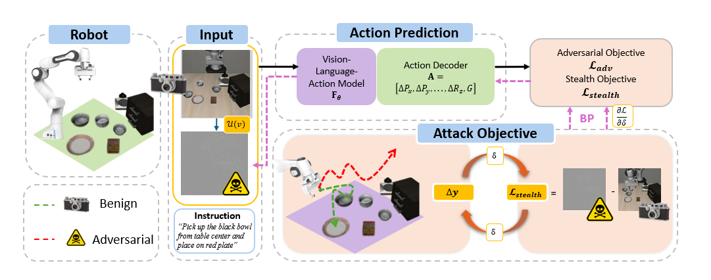
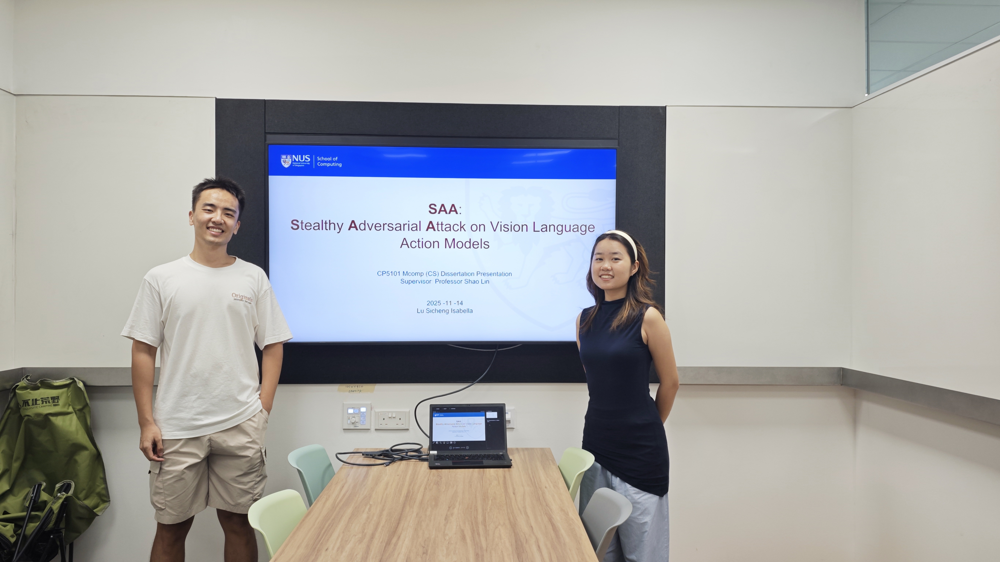

## Overview of Attack Methodology

$$ 
\left\lVert f_\theta(v + \delta, l) - y^\text{true} \right\rVert_2 \ge \tau,\quad 
\mathcal{D}(v, v + \delta) \le \varepsilon
$$

Here we see two objectives defined: 
1. The attack objective 
> $
\left\lVert f_\theta(v + \delta, l) - y^\text{true} \right\rVert_2 \ge \tau,
$
2. The Stealth objective 
> $ \mathcal{D}(v, v + \delta) \le \varepsilon$

Each objective are assigned with a threshold to define training optimal. 

They are trained in an alternative optimization algorithm inspired by [SPAA](https://arxiv.org/pdf/2012.05858), the algorithm is heavily altered to adapted to the adversarial need of VLA attacker. 

To understand more, you can check out my [presentation](/saa-presentation.pdf) or contact me at lusicheng@u.nus.edu 

## Simulation Experiment Result 

UPL is applied to the LIBERO Spatial Suite, showing task failure due to discrepancy in action

- d_thr = 15
- p_thr = 0.3

## Supplementary Training Information Report

## Photo with my senior 

My supervisor [Prof Shao](https://www.comp.nus.edu.sg/cs/people/shaol/) assigned one of his all mighty PhD to provide some support. Turns out, [Chongkai](https://chongkaigao.com/) is one of the best mentor I ever had. I appreciate his guidance very very much.

<!-- ## Guide on Finding a Professor 

## How to get started 

## Implementation

## Someone that is really important -->
